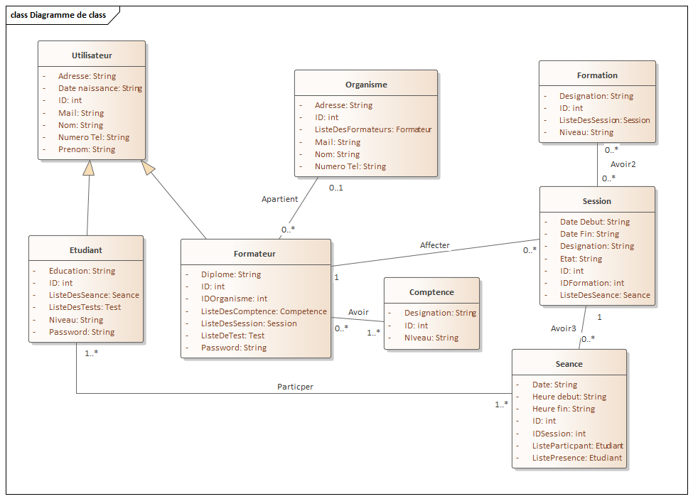
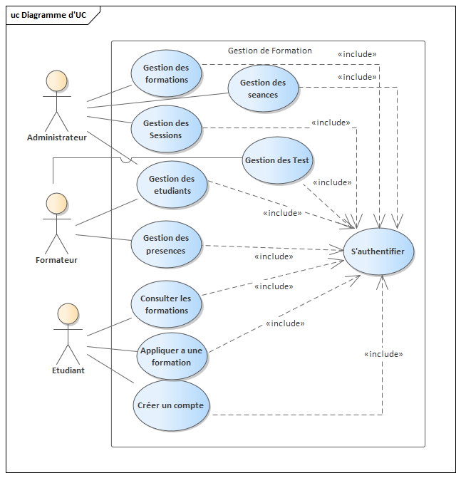
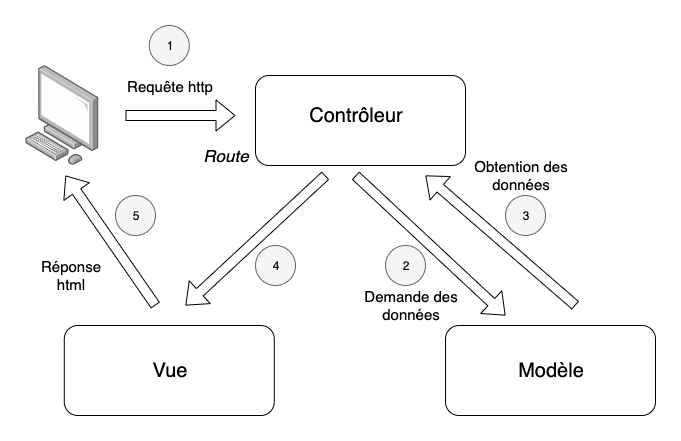

  

<h6 align="center">
  
</h6> 
 
<h1 align="center"> Symfony Application 5.3.x </h1>

it's a project for training center managment.
<h2> * There are three profiles of people who can use this training managment web site : </h2> 

- Adminstrator  
- Teacher  
- Student  

<h2> * Administrator: </h2>  

- Manage teachers.
- Manage Students.
- Manage Session of training.
- Manage Trainig.
- Manage classes.

<h2> * Teacher: </h2>  

- Had a list of there sessions.
- Had a list of there classes.
- Had a list of there student.

<h2> * Student: </h2>  

- For the first time, he had a list of trainind which is shared on the web site of training center.
- He can create an account.
- Applied to a training.
- Had a list of training that he applied and accepted from the administration.
- For each training had the list of classes with time.

<h2> About the application: (FR-fr) </h2> 

<h3 align="center"> ** Class Diagram ** </h3>   

<h3 align="center"> ** Use Case Diagram ** </h3>   

<h3 align="center"> ** Global application architecture  ** </h3>   

<h3 align="center"> ** Environment of development ** </h3>   
Symfony 5.3.X
